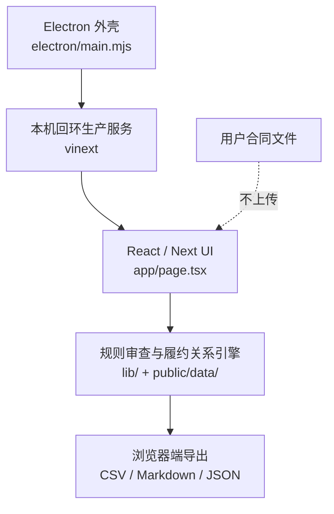

# 新能源合同审查助手

一个面向新能源业务的本地合同审查工作台。它不试图替代律师，也不把一份合同压缩成一个看似精确的分数；它更像第一轮筛查时放在手边的清单：哪些条款能定位、哪里可能影响履约、哪些法源需要打开核对、下一步该补什么。

## 我为什么做它

新能源合同的麻烦，往往不在于完全没有条款，而在于条款散在采购、技术附件、验收、质保、付款和项目合规之间。第一轮看合同的人，需要反复切换文档、规则和公开资料，容易漏掉“写了但不可执行”的细节。

这个项目从一个很具体的目标开始：把第一轮筛查做成一张可以复核的工作台。规则、命中条款、证据状态、法源链接和修改建议放在一起，法务人员可以沿着原文继续判断，而不是接受一个黑盒结论。

## 现在能做什么

- 在浏览器或 Windows 桌面程序中读取 PDF、DOCX、TXT、MD 文件；文件默认只在本地解析。
- 按储能采购、EPC、供应链、光伏、锂电池、项目开发、电力交易和运营安全等场景路由规则。
- 从采购方、供应商、发包方、承包方或项目公司视角复核风险。
- 按“法律红线 → 履约影响 → 完善建议”分层，展示命中条款、缺失要素、证据状态、法源依据和人工复核项。
- 比较两个版本的条款变化，导出风险表格、整改清单、Markdown 和 JSON。
- 提供相似案例素材和官方来源入口；所有引用都保留人工打开核验的路径。

## 一次审查是怎么走的


## 桌面程序结构



桌面版只是给现有网页工作台加了一层 Windows 外壳：界面和审查逻辑保持一致，Electron 在本机启动一个回环地址上的生产服务，再加载到独立窗口中。这样可以获得安装包，同时不需要把合同解析逻辑迁移到一套完全不同的后端。

## 快速开始

需要 Node.js 22 及以上版本。

```bash
npm ci

# 浏览器开发模式
npm run dev

# 构建后打开桌面程序
npm run desktop:dev

# 生成 Windows 安装版和便携版
npm run desktop:pack
```

桌面安装包会生成在 `release/` 目录。`desktop:pack` 会同时生成 NSIS 安装程序和无需安装的便携版；Windows 用户可以直接双击便携版试用，也可以使用安装版创建桌面快捷方式。

## GitHub Actions

仓库包含 `.github/workflows/build-windows.yml`。推送到 `main` 或手动运行工作流后，GitHub Actions 会在 Windows runner 上构建安装包，并将 `release/` 作为构建产物保存。正式发布前建议再补充应用图标、版本号和签名证书。

## 项目目录

```text
app/                    页面、交互和本地文件解析
lib/                    风险规则辅助逻辑与履约关系分析
public/data/            规则、法源、案例和场景数据
electron/main.mjs       Windows 桌面入口
DESIGN.md               项目级设计语言和 UI 约束
.github/workflows/      Windows 自动构建工作流
```

## 本地处理和边界

合同文件默认在浏览器进程中提取文本，不会因为点击“开始审查”就上传到服务器。点击公开案例或法源链接时，会交给系统浏览器打开对应页面。扫描件没有文本层时，需要先 OCR；当前版本也不会替用户确认法源的现行有效性。

结果是审查辅助，不是法律意见。严重级别的风险仍需核对完整合同、技术附件、项目事实、最新法规和官方来源。一个看起来很高的完整度分数，也只代表当前规则覆盖范围内暂未命中需要扣分的事项。

## 后续想做的事

- 增加可选 OCR 流程，并明确标注 OCR 不确定的定位结果。
- 把人工复核状态保存为可恢复的本地项目，而不是只存在当前页面会话中。
- 增加更多新能源项目模板，并让规则版本、法源版本和导出报告保持可追踪。
- 补充桌面版图标、自动更新和 Windows 签名。

## 开源说明

当前仓库没有预设开源许可证。公开到 GitHub 前，请根据你的使用和分发计划选择许可证；如果准备接受外部贡献，也建议先补一份贡献说明和行为准则。
